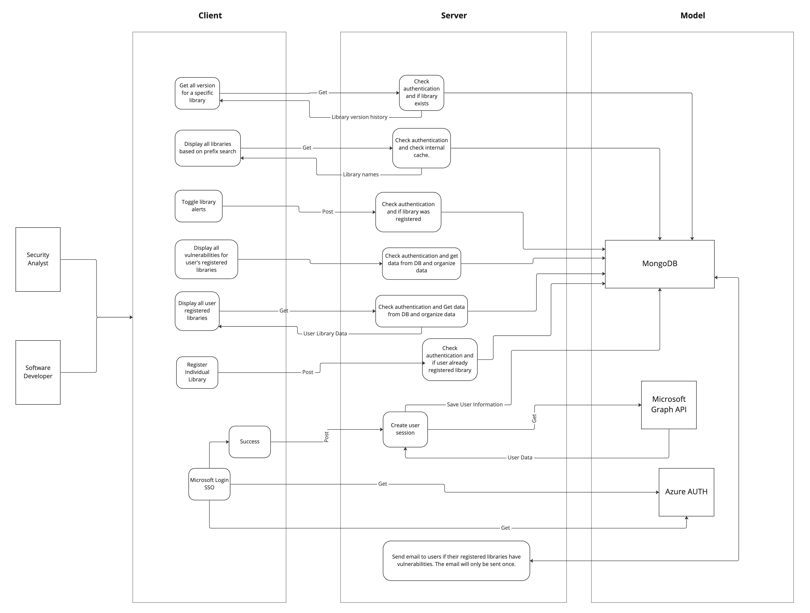

# Vulnerability Alerter

Group Members: Eric Kim, Aaron Liu, Jinwoo Kim

## Project Description
For our final project, we will be creating a full-stack web application that notifies the users of any new vulnerabilities in the libraries they use. This web application is primarily targeted toward software developers who may want to keep their applications up to date and reduce application security risks. 

There are vulnerability scanners and patch management systems out there that automatically remediate new application vulnerabilities. However, scanners have latencies, and automated patches could often result in cascading failures and unforeseen conflicts. Moreover, existing vulnerability management systems are typically targeted toward security experts and come bundled with other security tools, which limits their ease of use and coverage. 

Our application assumes that the users have limited security backgrounds, allowing the developers to better understand each security problem at hand. To keep our project scope small, the users could only register node.js packages. Then, they could investigate and respond accordingly based on instant vulnerability alerts, gain information about new exploits, and keep their applications safe. 

We, as developers, want to build this application because we often use dependency-laden frameworks and we share the responsibility of keeping the customer data safe. By using our application, we will become more security conscious, and patch up the applications and systems that we build to better protect data from cyber threats.

## Technical Description

### Architectural Diagram

  

### User Stories
| Priority | User       | Description                                                                                                                            | Technical Implementation                                                                                                                                                                                                                                              |
|----------|------------|----------------------------------------------------------------------------------------------------------------------------------------|-----------------------------------------------------------------------------------------------------------------------------------------------------------------------------------------------------------------------------------------------------------------------|
| P0       | Developers | I want to find out which libraries in my dependencies file have potential security risks so I can patch up the library.                | When retrieving security breach data, add a filter for each library.                                                                                                                                                                                                  |
| P0       | Developers | I want to set up alerts for the libraries I registered in the web app.                                                                 | After a valid user registration, the user can choose which library to alert.   Compare API and database data on new vulnerabilities to the libraries that the developers have registered in their account.   If the libraries match, send them an email notification. |
| P1       | Developers | I want to learn more about vulnerabilities that come with frameworks.                                                                  | Enter in framework information ( that is listed from the user/developer) and return information about vulnerabilities from APIs.                                                                                                                                      |
| P2       | Developers | I want to see a summary of the libraries I registered and the vulnerabilities that haven’t been patched in different severity ratings. | Fetch registration information from the database to show statistics on user                                                                                                                                                                                           |

### Endpoints
| Endpoint                                    | Purpose                                                                                               |
|---------------------------------------------|-------------------------------------------------------------------------------------------------------|
| GET /api/v1/libraries                       | Returns all registered libraries for the authenticated user                                           |
| POST /api/v1/libraries/register             | Add a new library for alerts for the authenticated user                                               |
| GET /api/v1/libraries/:prefix               | Returns all available libraries based on the given prefix.                                            |
| GET /api/v1/libraries/versions/:packageName | Returns all version numbers for the given library.                                                    |
| POST /api/v1/alerts                         | Toggle alerts for a library registered by the authenticated user.                                     |
| GET /api/v1/vulnerabilities                 | Returns all vulnerabilities for libraries registered by the authenticated user.                       |
| POST /api/v1/users/ms-login                 | Given Microsoft Account's access token, create user session and save user information in the database |
| POST /api/v1/users/logout                   | Destroy user session                                                                                  |

## Documentation

### Full Stack Application
> When running the full-stack application, the frontend production build is created, so the hot loading feature will be disabled.

To run full-stack web application in production mode, run the following command: `npm run prod`

To run full-stack web application in development mode, run the following command: `npm run dev`

- - - 
### Frontend
To run the frontend application in development mode, run the following command: `npm run frontend`

- - - 
### Backend
To run the backend server in production mode, run the following command: `npm run backend`

To run the backend server in development mode, run the following command: `npm run backend-dev`
